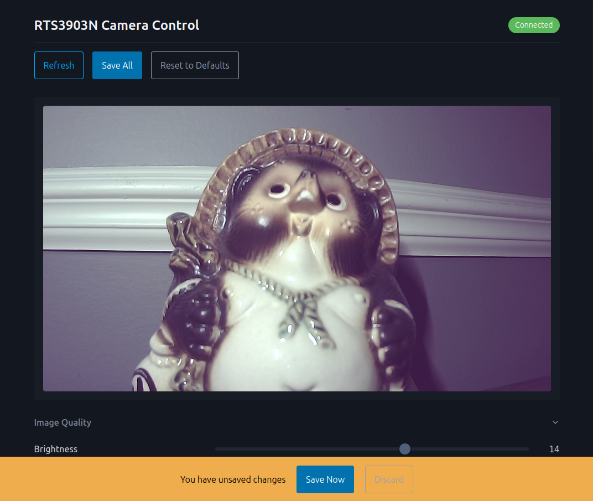

# Realtek RTS3903N based IP camera RTSP server

[](https://www.gnu.org/licenses/gpl-3.0)
[]()
[]()

A custom RTSP streaming server for Realtek RTS3903N-based IP cameras (including Yi/Kami cameras). Runs entirely from an SD card — **no flash modification required**.

> **Safe & Reversible**: Simply remove the SD card to restore original camera functionality.

---

## Features

- **H.264 RTSP Streaming** — Standard `rtsp://` URL compatible with VLC, FFmpeg, NVRs, and home automation systems
- **Web Control Interface** — Browser-based ISP parameter adjustment with live preview
- **JPEG Snapshots** — HTTP endpoint for capturing still images
- **Automatic Day/Night Switching** — IR cut filter control based on ambient light sensors
- **Pan-Tilt-Zoom Control** — PTZ motor support via `/dev/ssp`
  - This control has been implemented and tested on a Victure SC210. Other models may require adjustments.
  - Control is via telnet for now, but web interface integration is planned.
- **Configurable Parameters** — Resolution, bitrate, FPS, ISP settings via JSON config
- **Optional Authentication** — Username/password protection for RTSP stream
- **Telnet Access** — Remote shell access on port 23

---

## Quick Start

### Prerequisites

- RTS3903N-based IP camera (Yi Dome, Kami, or similar)
- MicroSD card (formatted as FAT32!)
- Ubuntu 20.04+ build system (for compilation)

### Building

```bash
# Install build dependencies
sudo bash scripts/install_deps_ubuntu.sh

# Build
mkdir build && cd build
cmake -G Ninja -S .. -B .
ninja

# Create deployment package
ninja package_RTS3903N_RTSP
```

This creates `RTS3903N-RTSP-X.X.X.tar` containing all binaries and configuration files.

### Installation

1. Extract the package to your SD card root
2. Edit `settings.json` with your preferences
3. Configure WiFi in `Factory/wpa_supplicant.conf`
4. Insert SD card into camera and power on
5. Wait ~60 seconds for boot
6. Access stream at `rtsp://CAMERA_IP:554/stream`
7. Access web interface at `http://CAMERA_IP/`

---

## Web Interface

The camera includes a modern web control interface accessible at `http://CAMERA_IP/`.



### Features

- **Live Preview** — Auto-refreshing JPEG snapshots
- **Save All** — Batch save changes to `settings.json` with unsaved changes warning

### API Endpoints

| Endpoint | Method | Description |
|----------|--------|-------------|
| `/cgi-bin/snapshot` | GET | Capture JPEG snapshot |
| `/cgi-bin/isp_ctrl` | POST | ISP control commands |

---

## Configuration

All settings are stored in `settings.json`

### ISP Parameters

| Parameter | Range | Description |
|-----------|-------|-------------|
| `brightness` | 0-100 | Image brightness |
| `contrast` | 0-100 | Image contrast |
| `saturation` | 0-100 | Color saturation |
| `sharpness` | 0-100 | Edge sharpness |
| `gamma` | 0-500 | Gamma correction |
| `noise_reduction` | 0-7 | Noise reduction strength |
| `ldc` | 0-1 | Lens distortion correction |
| `detail_enhancement` | 0-7 | Sharpening/detail enhancement |
| `three_dnr` | 0-1 | 3D noise reduction (temporal) |
| `mirror` | 0-1 | Horizontal flip |
| `flip` | 0-1 | Vertical flip |
| `in_out_door_mode` | 0-2 | Indoor(1)/Outdoor(0)/Auto(2) |
| `dehaze` | 0-1 | Haze removal filter |
| `wdr_mode` | 0-2 | Off(0)/Manual(1)/Auto(2) |
| `wdr_level` | 0-100 | WDR intensity |
| `exposure_mode` | 0-1 | Auto(0)/Manual(1) |
| `awb_mode` | 0-2 | Temperature(0)/Auto(1)/Component(2) |
| `gray_mode` | 0-1 | Force grayscale |

### Day/Night (IR) Control

The camera uses ADC light sensors to automatically switch between day and night mode:

- **Day mode**: IR cut filter engaged, color image
- **Night mode**: IR cut filter disengaged, grayscale with IR illumination

Some cameras have inverted sensor logic. If your camera switches modes incorrectly:

```json
"ir_control": {
  "invert": true,
  "adc_cutoff_inverted": 2750
}
```

---

## Architecture

```
┌─────────────────────────────────────────────────────────────────┐
│                        Camera Hardware                           │
│  ┌──────────┐    ┌─────────┐    ┌──────────────┐                │
│  │  Sensor  │───▶│   ISP   │───▶│ H.264 Encoder├──▶ FIFO        │
│  └──────────┘    └────┬────┘    └──────────────┘                │
│                       │                                          │
│                       └────────▶│ MJPEG Encoder├──▶ Snapshots   │
│                                 └──────────────┘                │
│  ┌──────────┐                                                    │
│  │ ADC/Light│───▶ day_night_ctrl                                │
│  │ Sensors  │                                                    │
│  └──────────┘                                                    │
└─────────────────────────────────────────────────────────────────┘
                                  │
            ┌─────────────────────┼─────────────────────┐
            │                     │                     │
            ▼                     ▼                     ▼
    ┌───────────────┐    ┌───────────────┐    ┌───────────────┐
    │  rtsp_server  │    │   lighttpd    │    │    snapshot   │
    │  (Live555)    │    │  (HTTP/CGI)   │    │    (JPEG)     │
    └───────┬───────┘    └───────┬───────┘    └───────────────┘
            │                    │
            ▼                    ▼
    rtsp://IP:554/       http://IP/
```

### Components

| Component | Description |
|-----------|-------------|
| `imager_streamer` | Captures video from ISP, encodes H.264 + MJPEG, manages FIFO and snapshot socket |
| `rtsp_server` | Reads FIFO, streams via RTSP/RTP (Live555) |
| `day_night_ctrl` | Monitors light sensors, controls IR cut filter |
| `isp_ctrl` | CGI program for runtime ISP adjustment |
| `snapshot` | CGI program for JPEG snapshot capture |
| `ptz_tool` | Pan-Tilt-Zoom motor control |
| `lighttpd` | Web server for control interface and CGI |

---

## Accessing the Camera

### RTSP Stream

```bash
rtsp://CAMERA_IP:554/stream
```

### Web Interface

Open `http://CAMERA_IP/` in a web browser.

### Snapshots

```bash
# Download a snapshot (also suitable for NVR grabs)
curl http://CAMERA_IP/cgi-bin/snapshot -o snapshot.jpg
```

### Telnet Shell

```bash
telnet CAMERA_IP 23
```

### Logs

```bash
# View boot log
cat /var/tmp/sd/boot.log

# View streaming logs (via telnet)
tail -f /var/log/rtsp_streamer.log
```

---

## Troubleshooting

### Day/Night mode switching incorrectly

Set `"invert": true` in the `ir_control` section of `settings.json`.

### Video artifacts or freezing

- Reduce resolution or bitrate in encoder settings
- Ensure adequate power supply to camera
- Check SD card for errors

### PTZ not responding

The camera performs a 30-second calibration on boot. Wait for calibration to complete before sending PTZ commands.

### Snapshots not working

Ensure `imager_streamer` is running. The snapshot service uses the same MJPEG encoder bound to the ISP.

### Web interface not loading

1. Check that `lighttpd` is running
2. Verify port 80 is not blocked
3. Check `/var/tmp/sd/boot.log` for HTTP server startup errors

---

## Development

### Project Structure

```
├── src/
│   ├── imager_streamer/    # Video capture, encoding & snapshot server
│   ├── rtsp_server/        # RTSP streaming server
│   ├── isp_ctrl/           # ISP control CGI
│   ├── snapshot_server/    # Snapshot CGI client
│   ├── isp_tool/           # ISP adjustment tool
│   └── ptz_tool/           # PTZ control
├── third-party/
│   ├── live555/            # RTSP library
│   ├── lighttpd1.4/        # HTTP server
│   ├── zlog/               # Logging library
│   ├── rtscore/            # Realtek SDK
│   └── rsdk/               # MIPS toolchain
├── sd_payload/             # Deployment files
│   ├── settings.json       # Configuration
│   ├── wifi/               # Network scripts
│   └── http/               # Web interface
│       ├── www/            # Static files (HTML, CSS)
│       ├── cgi-bin/        # CGI scripts
│       └── lighttpd.conf   # HTTP server config
└── scripts/                # Build utilities
```

### Cross-Compilation

The project uses the Realtek RSDK toolchain for MIPS cross-compilation. The toolchain is automatically extracted on first build.

**Requirements:**
- 32-bit library support (`gcc-multilib`)
- CMake 3.10+
- Ninja build system

---

## Roadmap

- [x] H.264 RTSP streaming
- [x] Automatic day/night switching
- [x] PTZ motor control
- [x] JSON configuration
- [x] Web-based ISP control
- [x] JPEG snapshots
- [x] lighttpd HTTP server
- [ ] Audio streaming
- [ ] ONVIF compatibility

---

## Credits

This project builds upon the work of many contributors:

### rtsp_server
- [@roleoroleo](https://github.com/roleoroleo) — Original author
- [@alienatedsec](https://github.com/alienatedsec) — Modified version
- [@cjj25](https://github.com/cjj25) — Modified version

### imager_streamer
- [Realtek](https://www.realtek.com/) — rt_stream examples
- [@cjj25](https://github.com/cjj25) — Original author

### sd_payload
- [@rage2dev](https://github.com/rage2dev/) — Original author
- [@cjj25](https://github.com/cjj25) — Modified version

---

## Resources

- [RTS3903N Tools](https://github.com/cjj25/RTS3903N-Tools) — Compiled binaries for debugging
- [Original Fork](https://github.com/cjj25/Yi-RTS3903N-RTSPServer) — Colin Jensen's version

---

## License

This project is licensed under the GNU General Public License v3.0 — see the [LICENSE](LICENSE) file for details.
